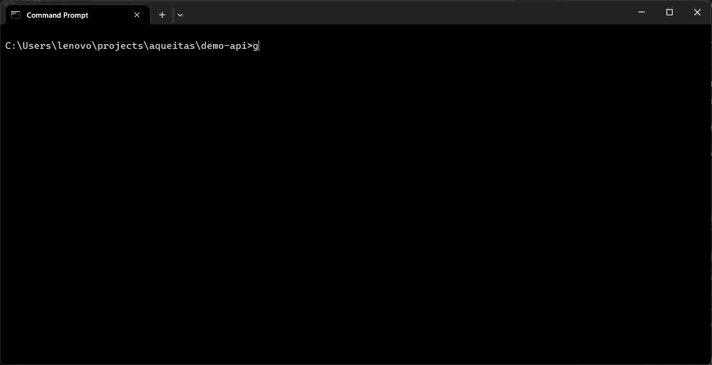
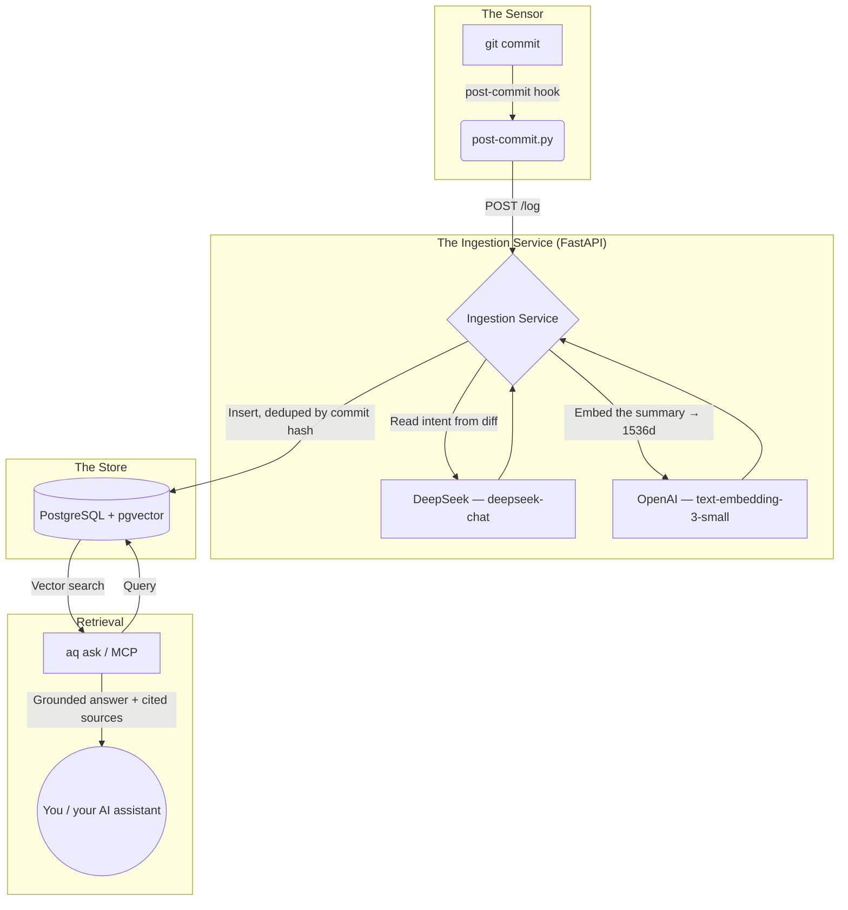

# Aqueitas — engineering memory from your git history

[](LICENSE) [](https://python.org) [](https://docker.com)

> Every commit records **what changed**. The **why** — the alternatives you weighed, the bug you were working around, the constraint that forced your hand — lives in your head and leaves with you. Aqueitas captures the why on every commit and makes it searchable months later.



Aqueitas runs entirely on your machine. On every commit, it reads the diff and message, records why the change was made, and stores it as searchable memory in a local database. Later — from the CLI or from any AI assistant that speaks MCP — you ask a plain-language question and get an answer grounded strictly in your own history, with the source commits cited.

---

## ⚡ Get running

### Prerequisites
- [Python 3.10+](https://python.org/downloads) — check with `python --version`
- [Docker Desktop](https://docker.com/products/docker-desktop) — running (hosts the local database)
- [Git](https://git-scm.com)

### 1. Configure (once)

By default Aqueitas uses two paid APIs — one to read intent from diffs, one to embed for search:

- **OpenAI key** → [platform.openai.com/api-keys](https://platform.openai.com/api-keys) *(embeddings, ~$0.02/1M tokens)*
- **DeepSeek key** → [platform.deepseek.com/api_keys](https://platform.deepseek.com/api_keys) *(reasoning, ~$0.14/1M tokens)*

> **No keys? Try it fully offline.** Set `EMBEDDING_PROVIDER=fake` and `REASONING_PROVIDER=passthrough` in your `.env`. The whole commit → store → ask loop runs with zero external calls: your commit messages become the intent summaries, and deterministic local vectors power search. Add real keys later — nothing else changes.

**Windows** — double-click **`CONFIGURE_AQUEITAS.bat`** (interactive, no file editing)
**Mac / Linux** — `python3 aq.py configure`

Or by hand: `cp .env.example .env` and fill in your keys (the same values go in `brain/.env`).

### 2. Install (once)

**Windows** — double-click **`INSTALL_AQUEITAS.bat`**, or `python aq.py install`
**Mac / Linux** — `python3 aq.py install`

Creates the Python environment, installs dependencies, and activates the git commit sensor. ~60 seconds first run.

### 3. Start

**Windows** — double-click **`START_AQUEITAS.bat`**, or `python aq.py start`
**Mac / Linux** — `python3 aq.py start`

Then check everything is healthy:

```bash
python aq.py doctor      # python3 on Mac / Linux
```

From now on, every commit you make — in any repo on your machine — is captured automatically.

---

## 🔍 Asking your history

```bash
python aq.py ask "how did I implement the auth flow in the DMS project?"
python aq.py logs        # the 10 most recent captured commits
python aq.py doctor      # full health check
```

Answers are built only from your captured commits. When nothing in your history matches, Aqueitas says so — it does not invent an answer.

---

## 🖥️ CLI reference

> On Mac / Linux, use `python3`.

| Command | What it does |
|---|---|
| `aq.py configure` | Write `.env` files from your keys (first-time setup) |
| `aq.py install` | Create the venv, install deps, activate the commit sensor |
| `aq.py start` | Start the database and the local service |
| `aq.py doctor` | Health check: Docker, database, service, sensor, and offline queue |
| `aq.py status` | Alias for `doctor` |
| `aq.py ask "..."` | Ask a question against your captured history |
| `aq.py logs` | Show the most recent captured commits |
| `aq.py replay` | Send commits that were captured while the service was offline |
| `aq.py mcp` | Run the MCP server (stdio) for AI-assistant integration |

---

## 🔌 Use it from your AI assistant (MCP)

Aqueitas is meant to be infrastructure other tools query, not another chat window. Any MCP-capable assistant can pull answers from your engineering history.

**Claude Code:**
```bash
claude mcp add aqueitas -- python /absolute/path/to/aqueitas/aq.py mcp
```

**Cursor / Claude Desktop** (`mcp.json` / `claude_desktop_config.json`):
```json
{
  "mcpServers": {
    "aqueitas": {
      "command": "python",
      "args": ["/absolute/path/to/aqueitas/aq.py", "mcp"]
    }
  }
}
```

| Tool | What it does |
|---|---|
| `query_sovereign_vault` | Answers from your history, with structured sources (commit, project, timestamp, excerpt). If the service is offline it returns an explicit error — never a fabricated answer. |
| `ingest_workspace` | Chunk and embed a local directory for code-aware retrieval. |

---

## 🔒 Privacy & data flow

Knowing exactly what leaves your machine is the point, so it's stated plainly:

- **Your history stays local.** Commits, embeddings, and answers live in a Postgres container on your machine.
- **With the default providers, two things leave per commit:** the diff and message go to DeepSeek (to read intent), and the resulting summary goes to OpenAI (to embed it). Diffs are capped at 50 KB before they're sent.
- **Fully offline mode** (`EMBEDDING_PROVIDER=fake`, `REASONING_PROVIDER=passthrough`) makes zero external calls.
- **The sensor is global** — it observes every repo you commit to. It runs each repo's own `post-commit` hook first, so nothing you already rely on breaks. To pause it: `git config --global --unset core.hooksPath`.
- **Nothing is lost if the service is down.** Commits queue locally and you replay them later; nothing is sent anywhere in the meantime.

---

## 🏗️ How it works



| Part | Built on | Role |
|---|---|---|
| Store | PostgreSQL + pgvector | Holds commit embeddings; deduplicated by commit hash so replays never double-count |
| Ingestion Service | FastAPI + asyncpg | Reads the *why* from each diff and writes it to the store |
| Sensor | Global git hook | Observes commits across every project, and chains to each repo's own hooks |
| Retrieval | `aq` CLI + MCP | Answers grounded in your history — sources cited, explicit when there's no record |

Every model is swappable via `.env` (`EMBEDDING_PROVIDER`, `REASONING_PROVIDER`, `EMBEDDING_MODEL`, `REASONING_MODEL`, `REASONING_BASE_URL`). The accumulated memory is the asset, not any one provider.

> **Optional:** an experimental remote-worker integration (AWS Fargate + Tailscale) lives behind `ATLAS_ENABLED=true`. It's off by default and the core system has no AWS dependency.

---

## 💡 Cost

| Model | Provider | Use | Cost |
|---|---|---|---|
| `deepseek-chat` | DeepSeek | Reading intent | ~$0.14 / 1M tokens |
| `text-embedding-3-small` | OpenAI | Embedding | ~$0.02 / 1M tokens |

A typical commit costs well under **$0.001** to capture; a commit is only ever captured once. Offline mode is free.

---

## 📖 Background

Aqueitas began as a small documentation script and grew into a local-first engineering memory system: no SaaS, no lock-in, your data on your machine.

- [The Aqueitas Manifesto](docs/AQUEITAS_MANIFESTO.md)
- [Architecture notes](docs/Aqueitas_2.0_Dissertation.txt)

## 🤝 Contributing

See [CONTRIBUTING.md](CONTRIBUTING.md). This project uses [Conventional Commits](https://www.conventionalcommits.org/).

## ⚖️ License

MIT — see [LICENSE](LICENSE).
