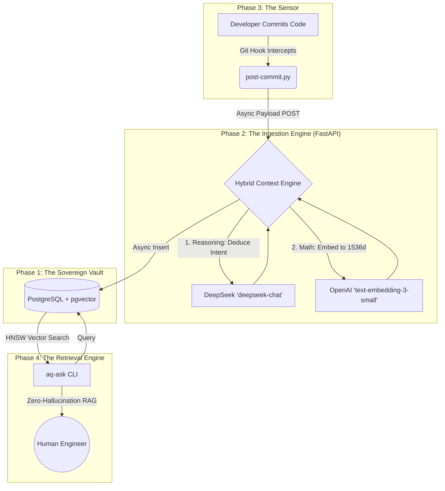

# Aqueitas: The Sovereign Engineering Operating System (EngOS)

Aqueitas executes the death of "passive forgetting" in software engineering. By automatically intercepting the byproduct of daily engineering (the code diff) and mathematically mapping its underlying logic, Aqueitas constructs an **Active Technical Memory**. It ensures that no effort is ephemeral, turning every keystroke into an undeniable, queryable intellectual asset.

---

## ⚡ See It In Action

*[Demo Video / GIF Goes Here — Show a real commit being intercepted, the 2-5 second reasoning block, and an `aq-ask` retrieval]*

---

## 🚀 Quickstart: Run Aqueitas in 5 Minutes

### Prerequisites
- Docker & Docker Compose
- Python 3.10+
- Git

### 1. Initialize Aqueitas
Install dependencies, setup the virtual environment, and configure global Git sensors:
```bash
python aq.py install
```
*Note: Edit `brain/.env` with your API keys after this command.*

### 2. Boot the Engine
Start the PostgreSQL Vault and the Intelligence Brain automatically:
```bash
python aq.py start
```

### 3. Verify Status
Check if everything is running correctly:
```bash
python aq.py status
```
*Any commit you make globally will now be intercepted, analyzed, and embedded into your Sovereign Vault.*

---

## 🏗️ The Aqueitas 2.0 Architecture

The system is strictly divided into four operational layers leveraging open-source, scalable technologies:



### Phase Breakdown:
1. **The Sovereign Vault:** PostgreSQL + `pgvector`. Data sovereignty prioritized natively handling 1536-dimensional embeddings with HNSW indexing.
2. **The Ingestion Engine:** FastAPI + `asyncpg` + DeepSeek/OpenAI hybrid routing. Extracts the "Why" (Intentionality) behind a code change and mathematically encodes it.
3. **The Sensor:** Global Git hooks (`core.hooksPath`) intercepting commits synchronously.
4. **The Retrieval Engine:** Vector search orchestration via CLI (`aq-ask`) constrained by a Zero-Hallucination Protocol.

---

## 📖 Deep Dive & Philosophy

Aqueitas evolved from a lightweight documentation script (1.0) into a mathematically rigorous Engineering Operating System (2.0) that prioritizes data sovereignty and eliminates SaaS lock-in. 

To understand the core philosophy and the technical evolution, read our detailed internal documents:
- [The Aqueitas Manifesto](docs/AQUEITAS_MANIFESTO.md)
- [Aqueitas 2.0: Dissertation & Architecture](docs/Aqueitas_2.0_Dissertation.txt)

---

## 💡 Financial & Operational Efficiency

The entire system is architected under the mandate of "Efficiency over Excess." By utilizing DeepSeek for reasoning ($0.14/1M tokens) and OpenAI for embeddings ($0.02/1M tokens), the API cost to ingest and retrieve thousands of code commits per month is fractions of a cent. 

## 🌍 Global Impact

The current industry standard relies on fragmented documentation (Notion, Slack, Jira) which inevitably fails under pressure, resulting in the mass evaporation of intellectual property. Aqueitas 2.0 redefines the relationship between the engineer and their output. It elevates the operator from a laborer writing syntax into a commander orchestrating captured intelligence.
